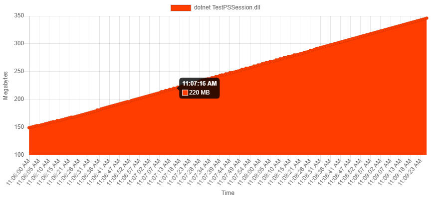
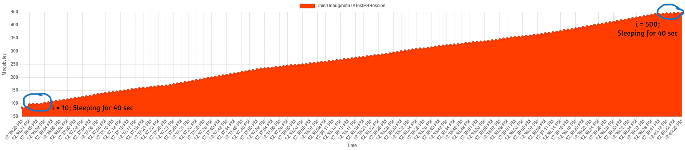
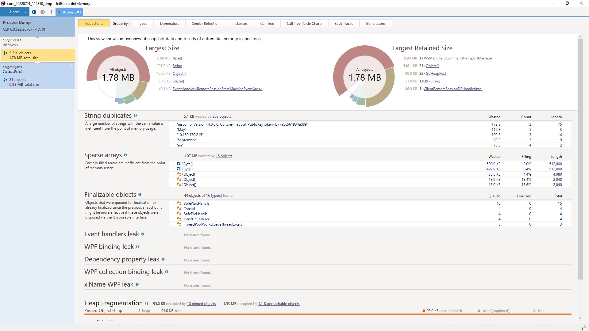
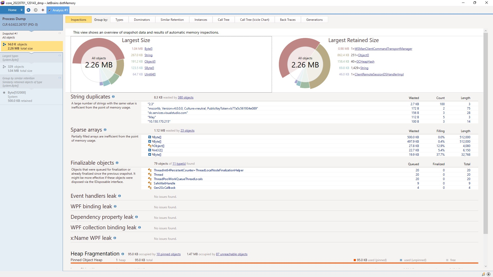

## Memory leak in PowerShell remote session in Linux.

### Running

1. Clone this repository.
2. Copy `.env.example` to `.env`.
3. Update the hostname, username, and password values to some remote computer.

4a. Running as a docker container:

```sh
docker run --memory="300m" --memory-swap="300m" --env-file .env --name testpssession -it -d nascarsayan/testpssession:latest
```

4b. Running as a kubernetes deployment:

```sh
kubectl create secret generic pscreds --from-env-file=.env
kubectl create -f deployment.yaml
```

4c. Running under a memory cgroup:

Build the program.

```sh
dotnet build
```

Create a memory cgroup with memory limits, under which the process will be run.

```sh
# Create a cgroup
sudo cgcreate -g memory:testps
# Set memory limit as 1 Gb and no swap (set swap memory = memory to disable swap).
echo 1G | sudo tee /sys/fs/cgroup/memory/testps/memory.limit_in_bytes
echo 1G | sudo tee /sys/fs/cgroup/memory/testps/memory.memsw.limit_in_bytes
```

If you want to take memory dump, set the env variable.
```sh
export WAIT_FOR_DUMP=True
```

Run the program under the cgroup.

```sh
# Export the connection credentials.
export $(cat .env | xargs)
# Execute the process in the cgroup.
sudo -E cgexec -g memory:testps ./bin/Debug/net6.0/TestPSSession
```

### Taking memory dump.

I followed the steps present [here][debug_managed_mem_leak] to take the memory dump and analyze.

```
dotnet tool install dotnet-counters
dotnet tool install dotnet-dump
dotnet tool install dotnet-symbol
dotnet tool install dotnet-sos
```

Run the process, get PID using `dotnet-counters ps`.

When you want to take memory dump, run:
```
dotnet-dump collect -p <process_id>
dotnet-symbol --debugging core_*
```
Copy the pdb file from `./bin/Debug/net6.0/TestPSSession.pdb` to the dump folder.

### Analysis

**When the program is run on Windows, the memory does not shoot up. GC works perfectly fine, and the memory usage remains bounded.**

In linux environment, the memory usage of the app constantly increases, irrespective of how it's run (as container, inside docker, k8s, or simply locally).

The graph below was captured using [mem_usage_ui][mem_usage_ui]
while running the program as a docker container (without sleeping for taking memory dump).



I ran the I took the heap dump at `i=10` and `i=500` by sleeping for 40 seconds. The memory usage looks like this:



I copied the dump and symbol files from the linux machine to a windows machine where [DotMemory][dotmemory] was installed.

I opened the `core_id` memory dumps in DotMemory.

`i = 10` | `i = 500`
:-------------------------:|:-------------------------:
  |  

I also tried to install `lldb` on Linux, and debug the `coreCLR` memory usage, but that is still in progress.

<!-- References -->
[mem_usage_ui]: https://github.com/parikls/mem_usage_ui
[debug_managed_mem_leak]: https://docs.microsoft.com/en-us/dotnet/core/diagnostics/debug-memory-leak
[dotmemory]: https://www.jetbrains.com/dotmemory/
